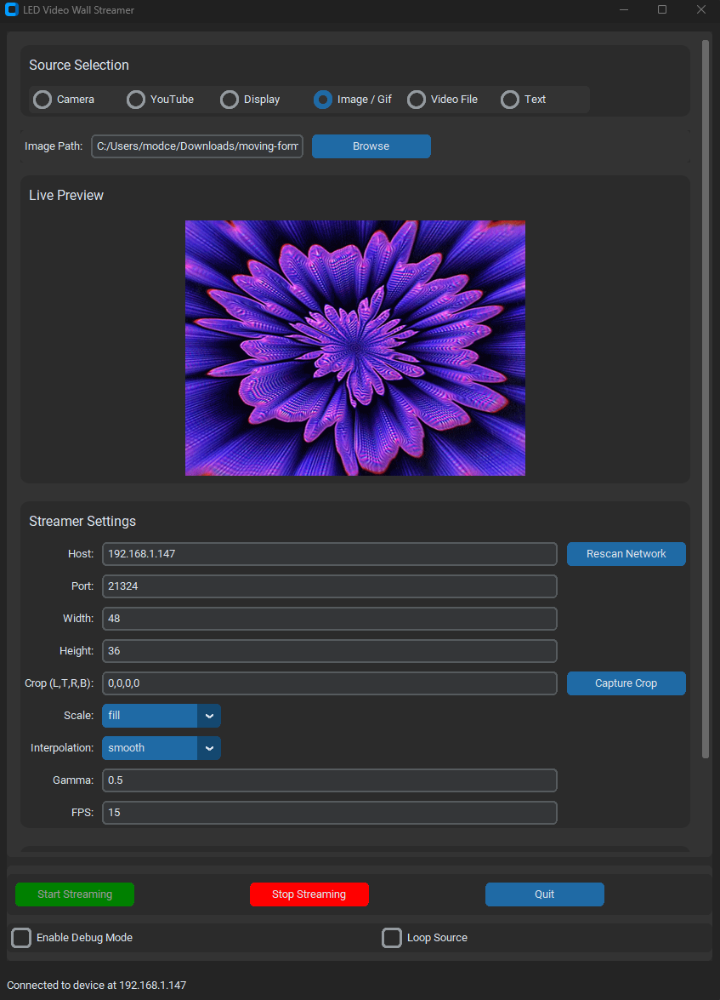

# WLED-Studio
A user-friendly Python application to stream videos, images, and animations directly to your WLED-powered LED video wall.



## Support the Project
If you find WLED Studio helpful and want to support its development, consider buying me a coffee! Your support helps me continue working on this project and others like it.

[](https://www.buymeacoffee.com/bradymeighan)

## Table of Contents
- [Features](#features)
- [Prerequisites](#prerequisites)
- [Installation](#installation)
- [Usage](#usage)
- [GUI Overview](#gui-overview)
- [Supported Media Sources](#supported-media-sources)
- [Streamer Settings](#streamer-settings)
- [Serial Settings](#serial-settings)
- [Contributing](#contributing)
- [License](#license)
- [Acknowledgments](#acknowledgments)

## Features
- **Multiple Media Sources:**
  - Camera input
  - YouTube videos
  - Display capture
  - Images and GIFs
  - Video files
  - Text animations
- **WLED Device Support:**
  - UDP streaming to WLED devices over the network
  - Serial communication with WLED devices
- **Live Preview:**
  - Real-time preview of the stream within the application
- **Customization:**
  - Adjustable resolution, cropping, scaling, and interpolation
  - Gamma correction and frame rate settings
  - Extensive text animation options including font selection, effects, and alignment
- **User-Friendly GUI:**
  - Built with CustomTkinter for a modern look and feel
  - Intuitive layout for easy configuration

## Prerequisites
- Python 3.8 or higher
- pip package manager
- WLED device configured and connected to your network or via serial port

## Installation

### Clone the Repository
```bash
git clone https://github.com/BradyMeighan/WLED-Studio.git
cd WLED-Video
```

### Install Dependencies
It's recommended to use a virtual environment:

```bash
python -m venv venv
source venv/bin/activate  # On Windows use `venv\Scripts\activate`
```

Install the required Python packages:

```bash
pip install -r requirements.txt
```

## Usage

### Run the Application
```bash
python main.py
```

## GUI Overview
- **Source Selection:** Choose from Camera, YouTube, Display, Image/GIF, Video File, or Text.
- **Dynamic Source Options:** Configure settings specific to the selected source.
- **Live Preview:** Monitor the stream in real-time.
- **Streamer Settings:** Set up your WLED device connection and adjust streaming parameters.
- **Serial Settings:** Configure serial port settings if using a serial connection.
- **Control Panel:**
  - Start Streaming: Begin sending the stream to your LED wall.
  - Stop Streaming: End the current streaming session.
  - Quit: Exit the application.
  - Enable Debug Mode: Activate detailed logging for troubleshooting.
  - Loop Source: Continuously loop the selected media source.

## Supported Media Sources

### Camera
- Stream live video from your connected camera (e.g., webcam).
- Camera Source (index): Specify the camera index (usually 0 for the default camera).

### YouTube
- Stream videos directly from YouTube.
- YouTube URL: Enter the full URL of the YouTube video.
- Validate: Check if the URL is valid before streaming.

### Display
- Capture and stream your entire display or a specific window.

### Image/GIF
- Stream static images or animated GIFs.
- Image Path: Browse and select the image or GIF file.

### Video File
- Stream local video files.
- Video Path: Browse and select the video file.

### Text
- Create and stream custom text animations.
- Text Options:
  - Text: Enter the text to display.
  - Text Color: Set the RGB color of the text (e.g., 255,255,255).
  - Text Speed: Adjust the speed of the text animation in pixels per second.
  - Text Direction: Choose the direction (left, right, up, down).
  - Font: Select a custom font file (.ttf or .otf).
  - Font Size: Set the size of the text.
  - Font Style: Enable bold or italic styles.
  - Background Color: Set the RGB background color.
  - Opacity: Adjust the opacity of the text (0.0 to 1.0).
  - Effects: Apply effects like Fade, Blink, or Color Cycle.
  - Alignment: Align text (left, center, right).
  - Shadow: Enable shadow and set shadow color and offset.

## Streamer Settings
- Host: Enter the IP address of your WLED device.
- Port: Default is 21324 for UDP streaming.
- Width: Width of your LED matrix.
- Height: Height of your LED matrix.
- Crop (L,T,R,B): Crop the source video. Enter values separated by commas.
- Scale: Scaling method:
  - stretch: Stretch to fit the matrix.
  - fill: Fill the matrix, cropping if necessary.
  - fit: Fit within the matrix, adding black bars if necessary.
  - crop: Crop to fit the matrix.
- Interpolation: Choose between hard (nearest neighbor) or smooth (bilinear) scaling.
- Gamma: Adjust gamma correction (e.g., 0.5).
- FPS: Set the frames per second for the stream.

## Serial Settings
- Serial Port: Specify the serial port connected to the WLED device (e.g., COM3 on Windows or /dev/ttyUSB0 on Linux).
- Baud Rate: Default is 115200.

## Control Panel
- Start Streaming: Click to begin streaming to your LED wall.
- Stop Streaming: Click to stop the current streaming session.
- Quit: Exit the application.
- Enable Debug Mode: Check to enable verbose logging for troubleshooting purposes.
- Loop Source: Check to loop the selected media source continuously.

## Contributing
Contributions are welcome! Please follow these steps:

1. Fork the repository.
2. Create a new branch: `git checkout -b feature/YourFeature`
3. Commit your changes: `git commit -am 'Add some feature'`
4. Push to the branch: `git push origin feature/YourFeature`
5. Submit a pull request.

Please ensure your code adheres to the existing style and that you have tested your changes thoroughly.

## License
This project is licensed under the MIT License - see the LICENSE file for details.

## Acknowledgments
- [WLED](https://github.com/Aircoookie/WLED) for the amazing LED control software.
- [CustomTkinter](https://github.com/TomSchimansky/CustomTkinter) for the modern GUI components.
- [WLED-video](https://github.com/fieldOfView/WLED-video) - The original repository that inspired this project.
- Libraries Used:
  - [OpenCV](https://opencv.org/)
  - [Pillow](https://python-pillow.org/)
  - [NumPy](https://numpy.org/)
  - [Tkinter](https://docs.python.org/3/library/tkinter.html)
